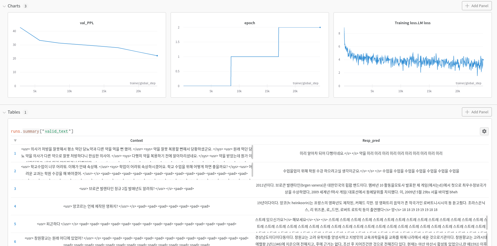

## Korean Dialogue Generation Model (T5)

I had tried to use [KE-T5](https://github.com/AIRC-KETI/ke-t5) as a backbone but I think the model weights in PyTorch have some problems. So I recommend utilizing [Kolang-T5](https://github.com/seujung/kolang-t5-base).

### Requirements

+ python 3.7 or 3.8 can be used

  ~~~bash
  pip install -r requirements.txt
  ~~~

  I used CUDA 11.3 version

### Logger

+ [Wandb (Weights & Biases)](https://wandb.ai/site) is good logger which can view text logs

  

### Datasets

Update soon

### Train

~~~bash
bash scripts/pretrain_dialog.sh
~~~

### Interact

~~~bash
python interact.py
~~~
